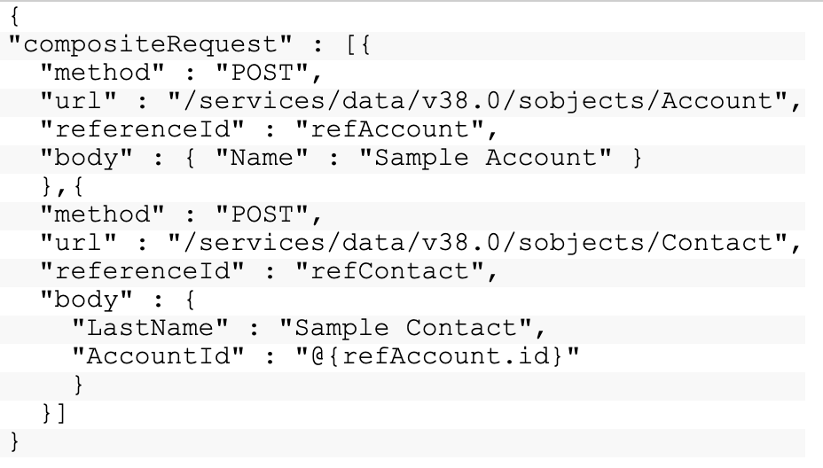

# Composite Graph API Demo

This repository is an example of the Composite Graph API. This feature is currently in pilot so you'll need to have the pilot enabled in your org.

To test thie composite graph api perform the following 

1. For the instructions Execute the `./scripts/orgInit.sh` script. Modify the script based on the instructions embedded in the script. 
2. Make a post api call to `/services/data/v48.0/composite/graph` using the [json](/data/dataload.json) provided

## Compsite API
The composite API allows you to execute a series of rest api requests in a single call. You can use the output of one request as the input to a subsequent request. 

This allows you to orchestrate API calls into a single transaction to save on round trips. What's even cooler is that the entire request counts as a single call towards your API limits.  

For example, if you want to create a new account and a new contact,  you can create the account and contact in the same api request and associate the contact to the account via a reference id. 

The composite API can have up to 25 sub-requests in a single call. Up to 5 of these subrequests can be an sobject collection of up to 200 records. This means in a single composite api request you could potentially create around 1,020 records. 

Even though this is very useful, we can see there are some limitations. That’s where the composite graph comes in. 

## Composite Graph API
The Composite graphs API, which is currently in pilot,  allows you to assemble a more complicated and complete series of related objects and records. Composite Graphs allow you to ensure all steps are completed or all not completed. They can be submitted synchronously or asynchronously. 

Composite graphs allows you to submit 500 nodes (subrequests) during synchronous usage or 100,000,000 per day for asynchronous usage. 

Note: A graph is a collection of connected nodes. 

Nodes are considered different if they use resources from differetn API versions and/or differetn types of objects.
For example: 

* v*48.0*/sobjects/account and v*49.0*/sobjects/account are considered different
* v48.0/sobjects/*account* and v48.0/sobjects/*contact* are considered different

## Example

Let’s pretend we have a property management app that apartment rental companies use to management locations. 
We can see from the data model we have a property object, a rental space (in this case it’s apartment unit details but could also be commercial space like a store front), we leverage the contact objects as renters, and we use a junction object to  associate the current renter to the rental space. 

What we want to do is load the properties, the related rental spaces, the current tenants (renters) and associate those renters to the space. We can do this in composite graph.  We desig

To do this, we write a json which is structure with graphs that have a unique graphId.  You can see the data example [here](/data/dataload.json).

## Additional Resources 
[Composite API Resources](https://developer.salesforce.com/docs/atlas.en-us.api_rest.meta/api_rest/resources_composite.htm)

